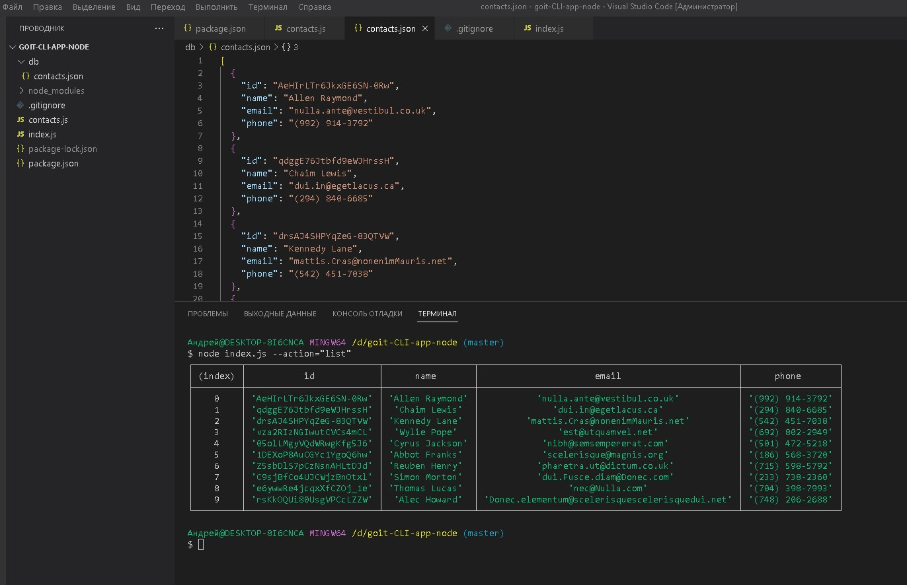
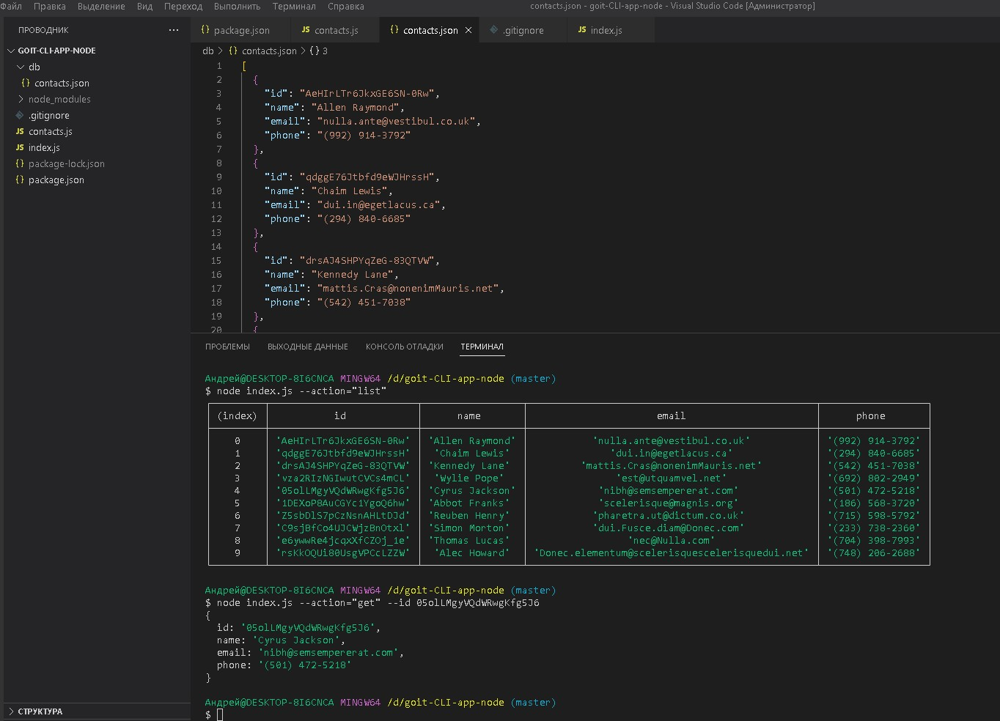
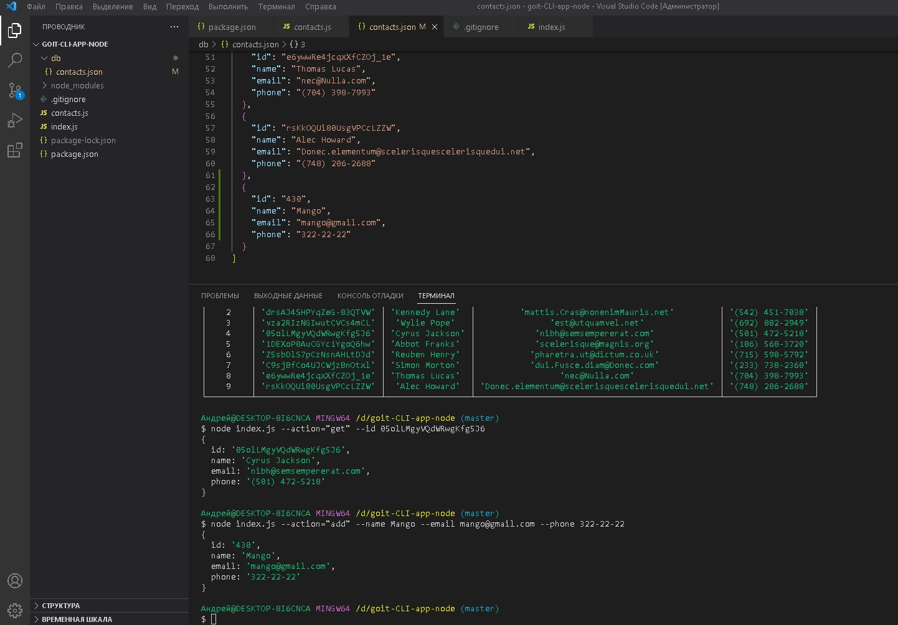
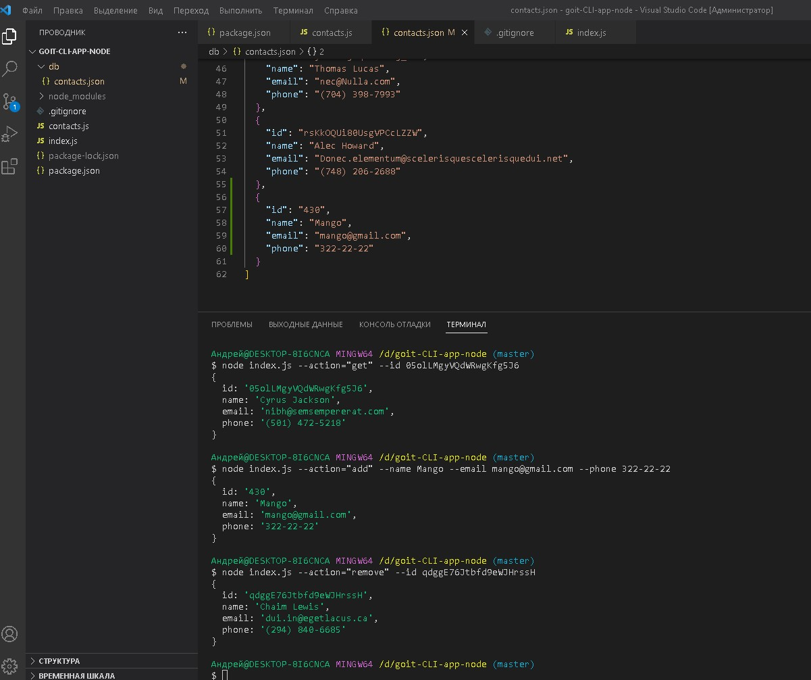

<h3>Usage:</h3>

There are 4 types of commands for actions listed above. You can find examples below, please run the commands in the terminal. 

<ol>
<li>node index.js --action="list" Receive and display the entire list of contacts. </li>
<li>node index.js --action="get" --id 05olLMgyVQdWRwgKfg5J6 Receive and display particular contact. </li>
<li>node index.js --action="add" --name Mango --email mango@gmail.com --phone 322-22-22 Add new contact to the list. </li>
<li>node index.js --action="remove" --id qdggE76Jtbfd9eWJHrssH Delete contact. </li>
</ol>

<h3>Screenshots of command execution:</h3>
<ol>
<li></li>
<li></li>
<li></li>
<li></li>
</ol>
